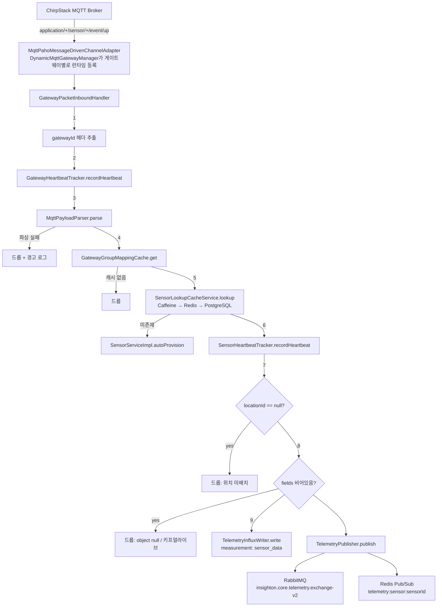

# InsightOn-core

InsightOn 스마트오피스 IoT SaaS 플랫폼의 중심 도메인/비즈니스 로직 서비스입니다.
멀티테넌트 그룹(조직) · 위치 · 대시보드 관리, 센서/액추에이터 디바이스 레지스트리,
**ChirpStack(LoRaWAN) MQTT 텔레메트리 수집**, InfluxDB 시계열 저장, RabbitMQ를 통한
타 서비스(insighton-ai, insighton-ruleengine)로의 이벤트 전파를 담당합니다.

같은 조직의 다른 저장소:

| 저장소 | 역할 |
|---|---|
| `insighton-gateway` | API Gateway (Spring Cloud Gateway) — 이 문서의 "Gateway 도메인"과는 별개 개념입니다 |
| `insighton-auth` | 인증/회원 서비스 |
| `insighton-front` | 프론트엔드 |
| `InsightOn-ai` | AI 리포트/분석 서비스 |
| `insighton-ruleengine` | 자동 제어 규칙 엔진 |
| `InsightOn-actuator-simulator` | LG ThinQ / SmartThings 액추에이터 목(mock) 서버 |
| `insighton-infra`, `insighton-k8s-manifests` | 인프라/배포 매니페스트 |

> ⚠️ 이 저장소의 **"Gateway"는 API Gateway가 아니라 물리 IoT 프로토콜 게이트웨이(LoRaWAN 네트워크 서버 등)** 를 뜻합니다. 자세한 내용은 [Gateway 도메인](#gateway-도메인) 참고.

---

## 목차

- [기술 스택](#기술-스택)
- [도메인 모델](#도메인-모델)
- [MQTT 텔레메트리 수집 파이프라인](#mqtt-텔레메트리-수집-파이프라인)
- [Gateway 도메인](#gateway-도메인)
- [RabbitMQ / AMQP](#rabbitmq--amqp)
- [InfluxDB](#influxdb)
- [보안 모델](#보안-모델)
- [API 구조](#api-구조)
- [설정 (프로파일)](#설정-프로파일)
- [로컬 실행](#로컬-실행)
- [테스트](#테스트)
- [알려진 제약 / TODO](#알려진-제약--todo)

---

## 기술 스택

- **Java 21**, **Spring Boot 3.5.16**, Spring Cloud `2025.0.3`
- **Spring Integration** (`spring-integration-mqtt`, `-jpa`, `-redis`, `-amqp`) — MQTT 인바운드 채널 어댑터를 런타임에 동적으로 등록/해제하는 데 사용
- **Eclipse Paho** (`org.eclipse.paho.client.mqttv3`) — ChirpStack MQTT 브로커 연결용 클라이언트
- **PostgreSQL** + Spring Data JPA + QueryDSL 5.1 (jakarta) — 정적 도메인 데이터
- **InfluxDB** (`influxdb-client-java` 6.12.0) — 센서 시계열 데이터, 액추에이터 상태 이력
- **Redis** — 분산 락(게이트웨이 MQTT 소유권), 센서 EUI 캐시, 텔레메트리 Pub/Sub (텔레메트리용 Redis는 물리적으로 별도 인스턴스)
- **Caffeine** — 센서 EUI 조회 로컬 캐시 (3단 캐시의 1단)
- **RabbitMQ** (`spring-boot-starter-amqp`) — 도메인 이벤트/텔레메트리 발행 전용 (이 서비스는 소비자 없음)
- **OpenFeign + Spring Cloud LoadBalancer** — insighton-auth 등 타 서비스 호출 (서비스 디스커버리 없이 k8s DNS + 클라이언트 사이드 LB)
- **springdoc-openapi 2.8.5** — Swagger UI, `*ControllerApi` 인터페이스로 문서 어노테이션과 컨트롤러 구현 분리
- **MapStruct 1.6.3**, **Lombok**, **spring-retry + AOP**
- Micrometer Tracing + Zipkin(Brave)
- 테스트: JUnit5, Mockito, `spring-rabbit-test`, `spring-integration-test`, H2 (Testcontainers 미사용)

---

## 도메인 모델

`com.insighton.core.domain.*` 하위 주요 패키지:

| 도메인 | 설명 |
|---|---|
| `groups` | 테넌트(조직) 단위. 이름, 설명, 지역(`groupRegion`), 초대 토큰 보유. 멀티테넌시의 루트 |
| `groupmember` | 그룹 멤버십 + RBAC (`MEMBER` / `MANAGER` / `SUPER_MANAGER`). 대부분의 권한 검사가 여기서 파생 |
| `groupregistration` | 신규 그룹 생성 승인 워크플로 (관리자 승인 전 대기열) |
| `gateway` | 물리 IoT 프로토콜 게이트웨이 자산 + MQTT 접속 정보. [상세](#gateway-도메인) |
| `sensors` | IoT 센서/디바이스 레지스트리. 게이트웨이·위치·그룹에 연결, MQTT 파이프라인의 중심 |
| `sensorattributes` | 센서가 노출하는 지표(metric) 메타데이터 (`MetricDefinition` 전역 카탈로그 + `SensorAttribute` 매핑) |
| `location` | 그룹 내 물리 공간. 센서/액추에이터/대시보드가 배치되는 단위 (`autoControlMode` 기본값 `SUGGESTION`) |
| `actuators` | 제어 가능한 스마트 디바이스 (`LG_THINQ` / `SMART_THINGS` 클라우드 API로 제어, MQTT와 무관) |
| `actuatorrunlogs` | 액추에이터 명령 실행 이력 (`USER` / `AI_SYSTEM` / `RULE_ENGINE` 실행 주체 구분) |
| `dashboards` / `widgets` | 위치별 대시보드와 위젯, InfluxDB 기반 차트 데이터 조회 |
| `region` | CSV(`data/locations.csv`)로 로드되는 행정구역 레지스트리, `groupRegion` 검증/조회용 |
| `weather` | 기상청/대기질 외부 API 연동, Redis 캐시, 대시보드/룰엔진에 날씨 컨텍스트 제공 |

---

## MQTT 텔레메트리 수집 파이프라인

가장 핵심적인 부분입니다. ChirpStack(LoRaWAN 네트워크 서버)이 발행하는 MQTT 업링크를
받아 파싱 → 센서 자동 프로비저닝 → InfluxDB 적재 → RabbitMQ/Redis로 전파하는 흐름이며,
동시에 **여러 core 인스턴스(Pod)가 게이트웨이별 MQTT 연결을 나눠 소유**하는 분산 조정 로직을 포함합니다.

관련 패키지:
- `com.insighton.core.adapter.mqtt.connection` — 연결 수명주기, 소유권 조정, 락, 캐시
- `com.insighton.core.adapter.mqtt.listener` — 페이로드 파싱, 패킷 핸들러, 텔레메트리 발행
- `com.insighton.core.domain.gateway` — 게이트웨이 엔티티 및 MQTT 접속 정보

### 전체 흐름



### 1. 연결 수명주기 & 다중 인스턴스 소유권

MQTT 접속 정보(`connection_config`)는 `Gateway` 엔티티에 저장되고, 실제 Paho 연결은
**DB에 정의된 게이트웨이 수만큼 런타임에 동적으로** 생성됩니다(`@Bean`으로 고정 선언하지 않음).
서비스는 Kubernetes **StatefulSet**으로 여러 개 떠서, 게이트웨이 연결을 인스턴스끼리 나눠 갖습니다.

- **`InstanceIndexEnvironmentPostProcessor`** (`common/config`) — `EnvironmentPostProcessor`로 등록(`META-INF/spring.factories`). Pod의 `HOSTNAME`(StatefulSet 명명 규칙 `<name>-<ordinal>`)에서 서수를 파싱해 `instance.slot-index` 프로퍼티로 주입 → 별도 설정 없이 각 Pod가 자기 슬롯 번호를 앎.
- **`GatewayMqttConnectionReconciler`** (`adapter.mqtt.connection`) — `@Scheduled(fixedDelay = 10_000)`로 10초마다 전체 MQTT 게이트웨이를 순회하며 소유권을 조정:
  - 선호 소유자(preferred owner) = `gatewayId % instanceTotalCount == instanceSlotIndex`
  - 이미 로컬에 등록돼 있으면: `connection_config` 변경 감지 시 강제 재등록, 선호 소유자가 아니고 실제 선호 소유자가 살아있으면 자발적으로 반납, 아니면 Redis 락 TTL 갱신(갱신 실패 시 = 락을 다른 인스턴스에 뺏긴 것 → 로컬 연결 강제 해제)
  - 미등록 상태면: 선호 소유자는 즉시 시도, 비선호 인스턴스는 `BACKUP_GRACE_TICKS = 3`틱(~30초) 동안 아무도 못 가져가면 백업으로 대신 접속 시도 (원 소유자 장애 감지)
  - `@EventListener(ContextClosedEvent.class)`로 정상 종료 시 보유 중인 Redis 락을 즉시 반납 — `@PreDestroy` 대신 `ContextClosedEvent`를 쓴 이유는, Redis 커넥션(Lettuce)을 관리하는 `SmartLifecycle` 빈보다 **먼저** 실행되어야 Redis가 살아있는 상태에서 락 반납이 가능하기 때문 (클래스 자체에 상세 주석 있음)
- **`GatewayMqttLockService`** — Redis 기반 분산 락. 키 `gateway-mqtt-lock<gatewayId>`, TTL 30초, `setIfAbsent`로 획득. `renew`/`release`는 현재 소유자(`ownerId`)가 자신인지 재확인 후 수행 (단, renew/release가 원자적이지 않음 — Lua 스크립트 도입 필요성이 코드 내 TODO로 남아있음). 인스턴스 생존 여부는 `instance-alive:<instanceId>` 키(TTL 15초)로 별도 관리.
- **`DynamicMqttGatewayManager`** — `IntegrationFlowContext`로 `MqttPahoMessageDrivenChannelAdapter`를 등록/해제. 각 메시지에 `gatewayId` 헤더를 붙여 `GatewayPacketInboundHandler`로 연결 (`qos=1`, `completionTimeout=30000`).
- **`MqttClientFactoryProvider`** — `DefaultMqttPahoClientFactory` 생성. `cleanSession=false`(퍼시스턴트 세션 — 소유권 인계 중에도 QoS≥1 메시지가 브로커에 큐잉되도록 함), `automaticReconnect=false`(Paho 자동 재연결과 Spring Integration 어댑터의 재연결 로직이 충돌하므로 의도적으로 끔). `clientId`는 인스턴스와 무관하게 `insighton-<gatewayId>`로 고정.
- **`GatewayHealthMonitor`** — `@Scheduled(fixedDelay = 60_000)`. 하트비트 기준 `gateway.health.fault-threshold-seconds`(기본 1800초=30분) 이상 무응답이면 `Gateway.markFault()` + `reconciler.forceReconnect()` + `GatewayStatusChangedEvent` 발행. 응답 재개 시 복구 이벤트도 발행.
- **`GatewayMqttEventListener`** — `@TransactionalEventListener(AFTER_COMMIT)`로 `GatewayDeletedEvent`(연결 해제 + 캐시 evict), `GatewayBrokerChangedEvent`(연결 해제 → 다음 틱에 재조정)를 처리.

### 2. 캐시 계층

- **`GatewayConnectionInfoCache`** — 로컬 `ConcurrentHashMap`, 접속 정보 변경 감지용
- **`GatewayGroupMappingCache`** — Caffeine(최대 1만건), `gatewayId → groupId` 매핑. 매 패킷마다 DB 조회 없이 그룹(테넌트) 해석
- **`SensorLookupCacheService`** — **Caffeine → Redis → PostgreSQL 3단 캐시**로 `devEui` 조회. Redis 키 프리픽스 `sensor:eui:`, TTL 6시간. Caffeine 미스 → Redis 미스 → DB 조회 순으로 조회 후 상위 계층에 populate
- **`MqttCacheConfig`** — Caffeine 빈(`sensorEuiLocalCache`, 최대 5만건, write 후 10분 만료) + 전용 `sensorRedisTemplate`(Jackson2Json) 선언
- **`SensorCacheEventListener`** — `@TransactionalEventListener(AFTER_COMMIT)`로 캐시 동기화/삭제가 PostgreSQL 트랜잭션 커밋 **이후에만** 반영되도록 보장

### 3. 패킷 파싱

- **`MqttPayloadParser`** — 원시 페이로드(byte[]/String)를 Jackson으로 `ChirpStackUplinkPacket`으로 역직렬화 후 `CleanTelemetryPacket`으로 평탄화. JSON 파싱 실패 시 예외를 던지지 않고 `Optional.empty()` 반환 + 경고 로그 (잘못된 패킷 하나 때문에 MQTT 연결이 끊기지 않도록)
- **`ChirpStackUplinkPacket`** — ChirpStack 원본 포맷 매핑 (`deviceInfo.devEui`, `deviceInfo.deviceName`, 디코딩된 페이로드 `object` 맵). ChirpStack은 "device"라 부르지만 도메인 용어는 "sensor"로 통일

### 4. `GatewayPacketInboundHandler` (파이프라인의 종착점)

`MessageHandler` 구현체, 빈 이름 `gatewayPacketHandler`. 전체를 try/catch로 감싸 **어떤 예외도 MQTT 연결을 죽이지 않도록** 방어(연결이 끊기면 재연결 → 같은 패킷이 다시 실패 → 플래핑 방지). 처리 순서:

1. `gatewayId` 헤더 없으면 드롭
2. **파싱 성공/실패와 무관하게** 먼저 게이트웨이 하트비트 기록 (디코딩 안 되는 패킷도 게이트웨이가 살아있다는 신호는 됨)
3. 페이로드 파싱 실패 시 드롭
4. 그룹 매핑 캐시 미스 시 드롭
5. **센서 자동 프로비저닝**: EUI 캐시에 없으면 `SensorServiceImpl.autoProvision` 호출 (아래 참고)
6. 센서 하트비트 기록
7. `locationId == null`이면 드롭 — 새로 자동 프로비저닝된 센서는 항상 위치 미배정 상태이며, InfluxDB에 `location_id` 태그 없이 쓰면 나중에 되돌릴 수 없어 의도적으로 스킵
8. `fields`(디코딩된 측정값)가 비어있으면 드롭 — ChirpStack 코덱 디코딩 실패나 킵얼라이브성 업링크(`object: null`) 케이스. 하트비트/프로비저닝은 이미 끝난 상태이므로 안전
9. 성공 시 InfluxDB 쓰기 + 텔레메트리 발행 동시 수행

### 5. 센서 자동 프로비저닝 (`SensorServiceImpl.autoProvision`)

캐시에 없는 `devEui`가 들어오면:
- 캐시 만료지만 DB엔 이미 있는 레이스 컨디션 방어를 위해 `sensorRepository.findBySensorEui`로 재확인 → 같은 그룹이면 캐시만 재적재, **다른 그룹 소속이면 예외**(`InvalidSensorValueException`, EUI 중복 등록 방지)
- 신규면 게이트웨이/그룹 존재 검증 후 `Sensor`를 `location(null)`로 생성 (위치는 사용자가 대시보드에서 나중에 배치)

### 6. 하트비트

- `GatewayHeartbeatTracker` / `SensorHeartbeatTracker` — 순수 인메모리(`ConcurrentHashMap`), 매 패킷마다 DB 쓰기를 피하기 위해 의도적으로 비영속
- `SensorHeartbeatFlusher` — `@Scheduled(fixedDelay = 150_000)`(2.5분)마다 인메모리 스냅샷을 `Sensor.lastSeenAt`에 반영
- `GatewayHealthMonitor`(60초 주기)가 게이트웨이 하트비트를 읽어 FAULT 판정/복구 처리

---

## Gateway 도메인

`com.insighton.core.domain.gateway` — **API Gateway(insighton-gateway)와 무관**하게, LoRaWAN 등
IoT 프로토콜 게이트웨이 인프라 자산과 그 MQTT 접속 정보를 표현하는 도메인입니다.

- **엔티티 `Gateway`** (테이블 `gateways`): `gatewayId`, `groupId`(**unique** — 그룹:게이트웨이 = 1:1), `name`, `protocolType`(`MQTT` | `MODBUS_TCP`, 현재는 MQTT만 파이프라인 구현됨), `connectionConfig`(JSONB — `brokerUrls`, `topics`, `username`, `password`), `status`(`ACTIVE` | `FAULT`), `lastHeartbeatAt`
- **`MqttGatewayConnectionInfo`**(record) — `connectionConfig` JSON을 파싱. `brokerUrls` 필수(없으면 `InvalidGatewayConnectionConfigException`), `clientId`는 `insighton-<gatewayId>`로 결정론적 고정, `topics` 미지정 시 기본값 `application/+/sensor/+/event/up`(ChirpStack 표준 업링크 토픽 패턴)
- **서비스 `GatewayServiceImpl`**:
  - 생성: `brokerUrls` 검증 + 대상 그룹 MANAGER 이상 권한 필요 + 그룹당 게이트웨이 1개 사전 검증
  - 조회: 그룹 멤버면 누구나(멤버십에 따라 접속 정보 마스킹 여부 다름), 전체 목록은 `X-User-Role == ADMIN`만 가능
  - 수정: MANAGER 이상. `protocolType` 변경 시 `connectionConfig` 재제출 필수. `brokerUrls` 변경 시 기존 devEui 매핑을 신뢰할 수 없으므로 **해당 게이트웨이의 모든 센서/센서속성 삭제 + EUI 캐시 evict** 후 `GatewayBrokerChangedEvent` 발행
  - 삭제: MANAGER 이상, 센서 선삭제(FK) 후 게이트웨이 삭제, `GatewayDeletedEvent` 발행
- **컨트롤러** `GatewayController` (`/api/v1/gateways`) — `POST /`, `GET /{gatewayId}`, `GET ?groupId=`, `GET /admin`(관리자 페이징), `PUT /{gatewayId}`, `DELETE /{gatewayId}`. 클래스 주석에 헤더 신뢰 모델을 명시: *"X-User-Id/X-User-Role은 API Gateway가 인증 후 붙여주는 걸 신뢰하는 헤더 기반 모델. 실제 권한 검증은 Service에서 처리."*
- **관계**: `Gateway 1:1 Group`, `Gateway 1:N Sensor`. 액추에이터는 게이트웨이(LoRaWAN)와 무관하게 LG ThinQ/SmartThings 클라우드 API로 직접 제어됨

---

## RabbitMQ / AMQP

`RabbitConfig` (`common/config`). **이 서비스는 발행만 하고 소비는 하지 않습니다** (`@RabbitListener` 없음 — 큐는 소비 측인 insighton-ai/insighton-ruleengine이 선언).

- **`insighton.core-events`** (TopicExchange) — 라이프사이클/삭제/상태 이벤트, insighton-ai가 소비:
  - `group.deleted` → `ai-service.group-deleted.queue`
  - `location.deleted` → `ai-service.location-deleted.queue`
  - `gateway.status` → `ai-service.gateway-status.queue` (`GatewayHealthMonitor`의 FAULT/복구 전환 시 발행)
  - `actuator.deleted` → `ai-service.actuator-deleted.queue`
  - `sensor.deleted` → `ai-service.sensor-deleted.queue`
- **`insighton.core.telemetry.exchange-v2`** — `x-consistent-hash` 타입 커스텀 익스체인지, `hash-header = locationId`. 라우팅 키는 비워두고 `locationId` 헤더로 일관 해싱 → 같은 위치의 메시지는 항상 같은 큐로. 소비자는 insighton-ruleengine (큐/바인딩은 소비자 측에서 선언)

역방향(룰엔진/AI → core)은 AMQP가 아니라 **동기 REST**로 처리됩니다: `ActuatorInternalController`
(`PUT /internal/v1/groups/{groupId}/locations/{locationId}/actuators/state`, "룰엔진/AI 등 신뢰된 내부 서비스 전용")가
`ActuatorControlFacade`를 통해 LG ThinQ/SmartThings 어댑터를 호출합니다. 즉 실제 물리/클라우드 액추에이터 제어는
MQTT를 거치지 않습니다.

---

## InfluxDB

`InfluxConfig`: `InfluxDBClient` + `WriteApi`(batchSize 1000, flush 1000ms, bufferLimit 10000, 쓰기 실패 시 로그만 남기고 드롭).

- **`TelemetryInfluxWriter`** — measurement `sensor_data`, 태그 `groupId`/`location_id`/`sensor_eui`/`sensor_name`, 필드는 ChirpStack이 디코딩한 `object` 맵을 그대로 동적 적재
- **`ActuatorStatusInfluxWriter`** — measurement `actuator_status`, 태그 `group_id`/`location_id`/`actuator_id`/`actuator_type`, 필드 `status_value`(0/1). 상태 전이 시(`writeTransition`)와 매시간 하트비트 재기록(`writeHeartbeat`) 두 가지 쓰기 경로
- **`InfluxDbRepository`** — Flux 쿼리 실행 래퍼, `WidgetServiceImpl`/차트 데이터 유스케이스가 대시보드 차트를 만드는 데 사용

---

## 보안 모델

**Spring Security 의존성 자체가 없습니다.** 인증/인가는 전적으로 상류의 API Gateway(insighton-gateway)에
위임되어 있고, 이 서비스는 게이트웨이가 JWT 검증 후 붙여주는 헤더를 신뢰합니다.

- `X-User-Id` / `X-USER-ID` → `Long userId` (컨트롤러마다 대소문자 표기가 다르지만 HTTP 헤더는 대소문자 구분이 없어 동작상 문제는 없음)
- `X-User-Role` / `X-USER-ROLE` → `String userRole` (예: `GatewayServiceImpl.getAll`은 `"ADMIN"` 문자열 비교)

세밀한 인가(그룹 멤버십, MANAGER 이상 권한, 소유권 확인)는 중앙화되지 않고 각 서비스 계층에서
개별 구현됩니다 (`GatewayServiceImpl.requireManagerRole`/`requireGroupMembership` 등).

> ⚠️ `/internal/v1/**` 하위 내부 전용 컨트롤러(`InternalController`, `ActuatorInternalController`,
> `MetricDefinitionController`, `WeatherInternalController`)는 코드 레벨에서 별도 인증 체크가 전혀 없습니다.
> 클러스터 외부에 노출되지 않는다는 네트워크 레벨 신뢰에 전적으로 의존하므로, 배포 시 반드시 외부 접근을 차단해야 합니다.

---

## API 구조

공개 API (`com.insighton.core.controller.api`):

| 컨트롤러 | Base Path | 설명 |
|---|---|---|
| `GatewayController` | `/api/v1/gateways` | 물리 IoT 게이트웨이 CRUD |
| `GroupController` | `/api/v1/groups` | 그룹 CRUD, 초대 토큰 발급 |
| `GroupMemberController` | `/api/v1/groups/{group-id}/members` | 멤버십 관리 (가입/추방/탈퇴/권한 이전) |
| `GroupRegistrationController` | `/api/v1/group-registrations` | 신규 그룹 생성 신청/승인 워크플로 |
| `LocationController` | `/api/v1/groups/{group-id}/location` | 그룹 내 위치 CRUD |
| `SensorController` | `/api/v1/sensor` | 센서 조회/검색/수정/삭제 |
| `SensorAttributeController` | `/api/v1/sensor/{sensor-id}/attribute` | 센서별 지표 속성 관리 |
| `ActuatorController` | `/api/v1/groups/{group-id}/actuators` | 액추에이터 CRUD + 사용자 제어 명령 |
| `DashboardController` | `/api/v1/groups/{group-id}/location/{location-id}/dashboard` | 위치별 대시보드 CRUD |
| `ChartDataController` | `.../dashboard/widgets/{widget-id}/chart-data` | 위젯 차트 데이터 (InfluxDB 기반) |
| `RegionController` | `/api/v1/regions` | 행정구역 조회/검증 |
| `WeatherController` | `/api/v1/weather` | 날씨/대기질 조회 |
| `WeatherRecoveryController` | `/api/v1/weather` | 날씨 캐시/스케줄러 장애 복구 트리거 |

내부 전용 API (`com.insighton.core.controller.internal`, base `/internal/v1`), 다른 서비스가 호출:

| 컨트롤러 | 설명 |
|---|---|
| `InternalController` | 토큰 기반 그룹 가입(insighton-auth 호출), 멤버십 존재 확인, 위치 목록 조회(AI/룰엔진용) |
| `ActuatorInternalController` | 액추에이터 실행 로그 조회(AI 리포트용), 룰엔진/AI의 액추에이터 상태 변경 |
| `MetricDefinitionController` | 지표 정의 CRUD |
| `WeatherInternalController` | 내부 날씨 데이터 접근 |

Swagger 문서는 `com.insighton.core.controller.swagger.*ControllerApi` 인터페이스에 OpenAPI 어노테이션을
분리해서 선언하고, `@RestController` 구현체가 이를 구현하는 방식을 사용합니다. springdoc 기본 설정으로
`/swagger-ui.html`에서 확인할 수 있습니다.

---

## 설정 (프로파일)

`spring.application.name=insighton-core`. `.properties` 형식, base + 프로파일별 설정으로 구성됩니다.

- **base (`application.properties`)**: actuator 노출(`health,prometheus,gateway`), `spring.jpa.hibernate.ddl-auto=validate`, `service-url.auth=http://insighton-auth`
- **`local`** (`application-local.properties`): 로컬 Docker 스택 직접 연결용. 포트 `8300`, Postgres `localhost:5432/insighton`(schema `core`), Redis `localhost:6379` db 0, 텔레메트리 전용 Redis(별도 설정), RabbitMQ `localhost:5672` guest/guest, InfluxDB `localhost:8087`(org `insighton`, bucket `core_telemetry`), 액추에이터 어댑터는 `localhost:8090`(시뮬레이터)
- **`dev`** (`application-dev.properties` + `config/dev/*.properties`): 팀 공유 DB(`s3.java21.net:8000`), Redis db `35`, 텔레메트리 Redis는 포트 `16379`로 분리, RabbitMQ `admin` 계정, InfluxDB `localhost:8087`, KMA/대기질 API 키는 환경변수(`KMA_KEY` 등)로 주입, Zipkin 샘플링 `0.0`(사실상 비활성)
- **`prod`** (`application-prod.properties` + `config/prod/*.properties`): k8s liveness/readiness probe 활성화, `commons-dbcp2` 커넥션 풀(min-idle/max-idle/max-total=20), `spring.jpa.open-in-view=false`, InfluxDB `http://insighton-influxdb:8086`(k8s Service DNS), Redis db `320`, Zipkin 샘플링 `0.3`, 액추에이터 어댑터는 `insighton-actuator-simulator` k8s Service를 바라봄

서비스 디스커버리(Eureka/Consul)는 사용하지 않으며, 서비스 간 호출은 k8s DNS 기반 URL +
`spring-cloud-starter-loadbalancer`(클라이언트 사이드 LB)로 처리됩니다.

---

## 로컬 실행

`local` 프로파일 기준으로 다음 인프라가 필요합니다: PostgreSQL(schema `core`), Redis 2개(일반 캐시/락용 + 텔레메트리 Pub/Sub용, 같은 인스턴스를 다른 설정으로 써도 무방), RabbitMQ, InfluxDB. ChirpStack 브로커 없이도 기동 자체는 되지만, 실제 텔레메트리를 받으려면 `Gateway.connectionConfig`에 등록된 MQTT 브로커가 떠 있어야 합니다.

```bash
./mvnw spring-boot:run -Dspring-boot.run.profiles=local
```

프로덕션/개발 환경 값은 `config/dev/*.properties`, `config/prod/*.properties`를 참고하세요
(대부분 `${ENV_VAR}` 형태로 시크릿을 주입받습니다).

---

## 테스트

- JUnit5 + Mockito 중심, 총 85개 테스트 클래스
- `@ExtendWith(MockitoExtension.class)` 46개(서비스/유스케이스 순수 단위 테스트), `@WebMvcTest` 16개(컨트롤러 슬라이스), `@DataJpaTest` 8개(H2 기반 리포지토리), `@SpringBootTest` 2개(`GroupDeleteLocationConcurrencyTest`, `DashboardSaveUseCaseConcurrencyTest` — 실제 스프링 컨텍스트로 동시성 검증)
- Testcontainers는 사용하지 않음 (H2로 JPA 계층 테스트)
- MQTT 파이프라인 테스트는 `GatewayPacketInboundHandlerTest` 정도만 존재하며, `GatewayMqttConnectionReconciler`/`GatewayMqttLockService`/`DynamicMqttGatewayManager`의 다중 인스턴스 소유권 로직에 대한 단위 테스트는 아직 없음

```bash
./mvnw test
```

---

## 알려진 제약 / TODO

- `GatewayMqttLockService`의 renew/release가 원자적이지 않음 (코드 내 TODO: Lua 스크립트 도입 검토)
- 다중 인스턴스 MQTT 소유권 조정 로직(`GatewayMqttConnectionReconciler` 등)에 대한 테스트 커버리지 부족
- `X-User-Id`/`X-User-Role` 헤더 표기(`X-User-*` vs `X-USER-*`)가 컨트롤러마다 일관되지 않음
- `/internal/v1/**` 엔드포인트가 코드 레벨 인증 없이 네트워크 신뢰에만 의존 — 배포 환경에서 외부 노출 여부를 반드시 확인할 것
- `protocolType`에 `MODBUS_TCP`가 정의돼 있으나 실제 수집 파이프라인은 MQTT만 구현됨
