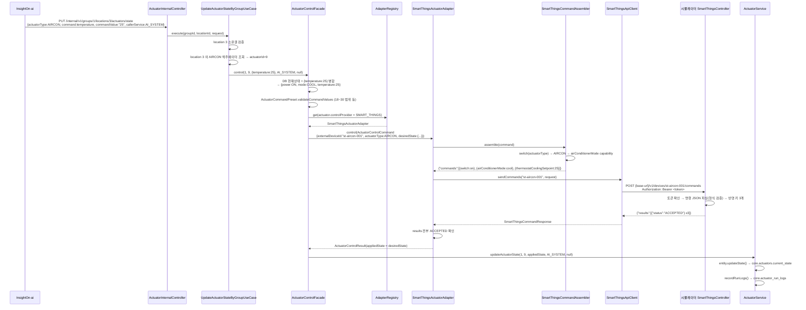

# 액추에이터 제어 흐름

> **관련 링크**
> - [InsightOn-core](https://github.com/nhnacademy-aiot3-insighton/InsightOn-core) — 브랜치 `feature/actuator-control-adapter`
> - [InsightOn-ai](https://github.com/nhnacademy-aiot3-insighton/InsightOn-ai)
> - [InsightOn-front](https://github.com/nhnacademy-aiot3-insighton/InsightOn-front) — 브랜치 `feature/actuator-provider-select`
> - 흐름 그림 문서: <https://claude.ai/code/artifact/941ae663-21a4-4114-9d30-c04a59aa336f>
> - **actuator-simulator** — 아직 별도 GitHub 저장소가 없어 압축 파일(`actuator-simulator.zip`)로 전달합니다.

---

## 0. 로컬로 돌리려면 — 필요한 파일과 수정 사항

어댑터·`control` 패키지·테스트는 이미 브랜치에 커밋돼 있습니다. **설정 파일만** 따로 챙기면 됩니다.

### 0-1. 한눈에

| 대상 | 무엇을 | 빠지면 |
|---|---|---|
| `core / src/main/resources/application-local.properties` | `actuator.*` 4줄 추가 (파일 자체가 없으면 §0-6 전문으로 생성) | CORE `local` 부팅 실패 — `ActuatorRestClientConfig`의 `@Value("${actuator.smartthings.base-url}")` 미해결 |
| `core / src/main/resources/application-dev.properties` | `actuator.*` 4줄 추가 | CORE `dev` 부팅 실패 (같은 이유) |
| `core / src/main/resources/application-prod.properties` | `actuator.*` 4줄 추가 | CORE `prod` 부팅 실패 |
| `core / src/test/resources/application.properties` | `actuator.*` 4줄 추가 | **전체 테스트** 컨텍스트 로딩 실패 |
| `core` DB — `core.actuators` | 컬럼 2개 `ALTER` | `ddl-auto=validate` 부팅 실패 (§14) |
| `actuator-simulator/` | 압축 파일 받아 IDE 임포트 | CORE가 붙을 상대가 없음 |
| `front / src/main/resources/application-local.properties` | (브라우저 조작 시만) 신규 생성 | Front가 Gateway·Auth 원격을 봄 → 안 뜸 |

### 0-2. `actuator.*` 설정 값 (프로파일별)

`application-local.properties` — 로컬은 시뮬레이터
```properties
actuator.smartthings.base-url=http://localhost:8090/smartthings
actuator.smartthings.token=local-sim-token
actuator.lg-thinq.base-url=http://localhost:8090/lg
actuator.lg-thinq.token=local-sim-token
```

`application-dev.properties` — 환경변수 없으면 로컬 시뮬레이터
```properties
actuator.smartthings.base-url=${ACTUATOR_SMARTTHINGS_BASE_URL:http://localhost:8090/smartthings}
actuator.smartthings.token=${ACTUATOR_SMARTTHINGS_TOKEN:local-sim-token}
actuator.lg-thinq.base-url=${ACTUATOR_LG_THINQ_BASE_URL:http://localhost:8090/lg}
actuator.lg-thinq.token=${ACTUATOR_LG_THINQ_TOKEN:local-sim-token}
```

`application-prod.properties` — 통합 환경 컨테이너
```properties
actuator.smartthings.base-url=${ACTUATOR_SMARTTHINGS_BASE_URL:http://actuator-simulator:8080/smartthings}
actuator.smartthings.token=${ACTUATOR_SMARTTHINGS_TOKEN:sim-token}
actuator.lg-thinq.base-url=${ACTUATOR_LG_THINQ_BASE_URL:http://actuator-simulator:8080/lg}
actuator.lg-thinq.token=${ACTUATOR_LG_THINQ_TOKEN:sim-token}
```

`src/test/resources/application.properties` — 컨텍스트 로딩만 통과 (실제 호출 안 함)
```properties
actuator.smartthings.base-url=http://localhost:0/smartthings
actuator.smartthings.token=test-token
actuator.lg-thinq.base-url=http://localhost:0/lg
actuator.lg-thinq.token=test-token
```

> 시뮬레이터의 `simulator.provider-token` 과 CORE의 `actuator.*.token` 이 **같아야** 합니다 (로컬은 둘 다 `local-sim-token`). 실제 연동 시 `base-url` 만 실제 API 주소로 바꿉니다.

### 0-3. DB 컬럼

```sql
ALTER TABLE core.actuators ADD COLUMN control_provider    varchar(30);
ALTER TABLE core.actuators ADD COLUMN external_device_id  varchar(150);
```

### 0-4. actuator-simulator

압축 파일을 풀어 IDE에 임포트. `application.properties` 는 포함되어 있음:
```properties
server.port=8090
simulator.provider-token=local-sim-token
```
프로파일 불필요, DB 없음. `./mvnw spring-boot:run` 또는 IDE Run.

### 0-5. 실행 순서 & 확인

1. **actuator-simulator** (8090)
2. **InsightOn-core** — Run 구성 **Active profiles = `local`** (⚠️ `dev` 면 팀 원격 DB를 봐서 안 뜸), port 8300, 로컬 Docker Postgres 필요
3. **InsightOn-front** — 선택. Active profiles = `local`, port 8400. 브라우저 개발자도구에서 쿠키 `userId=3`, `groupId=1` 직접 심기 (로그인 흐름 생략)

```bash
# 시뮬레이터 단독 확인 — 아무 deviceId나 받고 ACCEPTED를 돌려주면 정상
curl -s -XPOST "http://localhost:8090/smartthings/v1/devices/ping/commands" \
  -H "Authorization: Bearer local-sim-token" -H "Content-Type: application/json" \
  -d '{"commands":[{"component":"main","capability":"switch","command":"on","arguments":[]}]}'
# → {"results":[{"id":"...","status":"ACCEPTED"}]}

# CORE ↔ 시뮬레이터 연결 확인 — Front에서 공급자를 지정해 액추에이터를 만들고 카드에서 전원을 눌러본다.
# (또는 AI/룰엔진 경로: PUT /internal/v1/groups/1/locations/{id}/actuators/state)

# 로그 (액추에이터 조작하면 양쪽에 JSON이 찍힘)
tail -f core-local.log      | grep -E '\[SmartThings\]|\[LG ThinQ\]'   # CORE가 내보낸 JSON
tail -f simulator-local.log | grep -E 'SMART_THINGS|LG_THINQ'          # 시뮬레이터가 받은 JSON
```

### 0-6. `application-local.properties` 전문 (팀 표준 파일이 없을 때)

<details><summary>펼치기 — 로컬 Docker 스택(Postgres·Redis·RabbitMQ·InfluxDB)에 붙는 CORE local 프로파일</summary>

```properties
# 로컬 개발용 프로파일 - 팀 원격 인프라(Tailscale/공유 DB) 대신 로컬 도커 스택에 붙는다.
spring.application.name=insighton-core
server.port=8300

# --- datasource (docker: insighton-local-postgres) ---
spring.datasource.url=jdbc:postgresql://localhost:5432/insighton?currentSchema=core
spring.datasource.username=insighton
spring.datasource.password=insighton
spring.jpa.hibernate.ddl-auto=validate
spring.jpa.show-sql=true

# --- redis 락/캐시 (docker: insighton-local-redis) ---
spring.data.redis.host=localhost
spring.data.redis.port=6379
spring.data.redis.password=
spring.data.redis.database=0

# --- telemetry redis ---
telemetry.redis.host=localhost
telemetry.redis.port=6379
telemetry.redis.password=

# --- rabbitmq (docker: insighton-local-rabbitmq, guest/guest) ---
spring.rabbitmq.host=localhost
spring.rabbitmq.port=5672
spring.rabbitmq.username=guest
spring.rabbitmq.password=guest

# --- influxdb (docker: insighton-local-influxdb) ---
influxdb.url=http://localhost:8087
influxdb.token=dev-local-insighton-token-000
influxdb.org=insighton
influxdb.bucket=core_telemetry

# --- 부팅만 통과하도록 더미 ---
service-url.auth=http://localhost:8000
weather.api.kma-base-url=https://apis.data.go.kr/1360000/VilageFcstInfoService_2.0
weather.api.air-base-url=https://apis.data.go.kr/B552584/ArpltnInforInqireSvc
weather.api.kma-key=dummy
weather.api.air-key=dummy
management.tracing.sampling.probability=0.0

# --- 이번 브랜치: Actuator 공급자 Adapter ---
actuator.smartthings.base-url=http://localhost:8090/smartthings
actuator.smartthings.token=local-sim-token
actuator.lg-thinq.base-url=http://localhost:8090/lg
actuator.lg-thinq.token=local-sim-token

logging.level.root=INFO
logging.level.com.insighton.core=DEBUG
```
</details>

### 0-7. `front / application-local.properties` (브라우저 조작 시)

```properties
spring.application.name=insighton-front
server.port=8400
service-url.gateway=http://localhost:8300     # Gateway·Auth 없이 CORE 직접
server.forward-headers-strategy=framework
server.servlet.session.tracking-modes=cookie
management.endpoints.web.exposure.include=health
logging.level.com.nhnacademy.insightonfront=DEBUG
```

---

## 1. 한눈에

기존에는 AI·룰엔진·사용자가 상태 변경을 요청하면 CORE가 `actuators.current_state` 컬럼만 갱신했습니다. 실제 기기로 명령이 나가는 경로가 없었습니다.

지금은 CORE가 공급자(SmartThings / LG ThinQ)별 **어댑터**를 통해 실제 API를 호출합니다. 개발·시연 환경에서는 그 API 자리에 **시뮬레이터**가 들어갑니다. 시뮬레이터는 두 공식 API의 경로·페이로드를 그대로 흉내 내므로, CORE 입장에서는 상대가 시뮬레이터인지 실제 클라우드인지 구별하지 않습니다.

- **CORE ↔ 시뮬레이터는 코드·DTO를 하나도 공유하지 않습니다.** HTTP + JSON 계약으로만 통신합니다.
- **시뮬레이터는 상태도 기기 목록도 저장하지 않습니다.** 받은 명령 JSON을 파싱해 형식만 검증하고 `ACCEPTED`(혹은 `messageId`)를 돌려줍니다. deviceId가 무엇이든(실제 SmartThings처럼 UUID여도) 받습니다.
- **어느 공급자의 어떤 종류인지는 전부 CORE가 압니다.** 액추에이터를 등록할 때 공급자·종류를 고르면 `control_provider`·`actuator_type` 컬럼에 저장되고, `external_device_id`는 CORE가 자동 생성합니다 (`ExternalDeviceIdGenerator`).
- **상태의 진실은 CORE DB입니다.** 어댑터는 "공급자가 명령을 수락함 → 요청값이 적용됨"으로 간주하고 그 값을 CORE DB에 저장합니다.

---

## 2. 등장 컴포넌트

| 컴포넌트 | 위치 | 역할 |
|---|---|---|
| `SuggestionLogServiceImpl` / `ActuatorCommandExecutor` | InsightOn-ai | AI 제안 수락 시 CORE 내부 API 호출 |
| `ActuatorInternalController` | InsightOn-core `controller/internal/` | 룰엔진·AI 전용 진입점 |
| `UpdateActuatorStateByGroupUseCase` | `usecase/actuator/` | location + 종류로 대상 액추에이터 확정, 권한 검증 |
| `ActuatorControlFacade` | `usecase/actuator/` | **제어 흐름의 중심** — 병합·검증·어댑터 선택·성공 시 저장 |
| `ActuatorControlAdapterRegistry` | `domain/actuators/control/` | `ControlProvider` → 어댑터 매핑 |
| `SmartThingsActuatorAdapter` / `LgThinQActuatorAdapter` | `adapter/client/actuator/` | 공급자별 제어 구현 |
| `SmartThingsCommandAssembler` / `LgThinQControlAssembler` | 〃 | 중립 상태 → 공급자 JSON |
| `SmartThingsApiClient` / `LgThinQApiClient` | 〃 | `RestClient`로 실제 HTTP |
| `ExternalDeviceIdGenerator` | `domain/actuators/control/` | 등록 시 `external_device_id` 자동 생성 (`{공급자}-{종류}-{랜덤8자}`) |
| `SmartThingsController` / `LgThinQController` | actuator-simulator | 공급자 공식 API 흉내 — 명령 파싱 + `ACCEPTED` 응답 (상태·카탈로그 없음) |
| `SmartThingsRequestTranslator` / `LgThinQRequestTranslator` | actuator-simulator | 받은 공급자 JSON → 중립 명령 (형식 검증용, 잘못되면 400) |

---

## 3. 전체 흐름



---

## 4. AI — 제안 수락 → CORE 호출

| | 파일 |
|---|---|
| Feign 정의 | `InsightOn-ai` · `adapter/client/CoreClient.java` — `executeActuatorCommand` |
| 실행기 | `InsightOn-ai` · `adapter/client/ActuatorCommandExecutor.java` |
| 수락 처리 호출부 | `InsightOn-ai` · `domain/suggestion/service/impl/SuggestionLogServiceImpl.java:169` |

```
PUT /internal/v1/groups/{groupId}/locations/{locationId}/actuators/state
{
  "actuatorType":  "AIRCON",
  "command":       "temperature",      // CommandType.stateKey ("power" / "mode" / "temperature")
  "commandValue":  "25",               // 문자열
  "callerService": "AI_SYSTEM"         // USER 는 이 내부 API에서 거부됨
}
```

> `InsightOn-ai`의 `CoreClient` · `ActuatorCommandExecutor` · `SuggestionLogServiceImpl` · `SuggestionGenerationScheduler`도 이 경로(`groups/{groupId}` 포함)에 맞춰져 있습니다 (`InsightOn-ai` PR #115, 커밋 `57d3c3e`·`3c2b904`). 바디 DTO(`actuatorType`/`command`/`commandValue`/`callerService`)는 그대로입니다.

---

## 5. CORE 진입 — `ActuatorInternalController`

[`../src/main/java/com/insighton/core/controller/internal/ActuatorInternalController.java`](../src/main/java/com/insighton/core/controller/internal/ActuatorInternalController.java#L50)

```java
@PutMapping("/groups/{groupId}/locations/{locationId}/actuators/state")
public ResponseEntity<Void> updateActuatorStateByGroup(
        @PathVariable Long groupId,
        @PathVariable Long locationId,
        @Valid @RequestBody ActuatorCommandRequest request) {
    updateActuatorStateByGroupUseCase.execute(groupId, locationId, request);
    return ResponseEntity.ok().build();
}
```

`ActuatorCommandRequest` DTO: [`../src/main/java/com/insighton/core/domain/actuators/dto/ActuatorCommandRequest.java`](../src/main/java/com/insighton/core/domain/actuators/dto/ActuatorCommandRequest.java)

---

## 6. UseCase — 대상 확정 + 권한

[`../src/main/java/com/insighton/core/usecase/actuator/UpdateActuatorStateByGroupUseCase.java`](../src/main/java/com/insighton/core/usecase/actuator/UpdateActuatorStateByGroupUseCase.java#L27)

```java
public void execute(Long groupId, Long locationId, ActuatorCommandRequest request) {

    if (request.callerService() == ExecutedByType.USER)                 // 이 내부 API는 시스템만
        throw new InvalidServiceCredentialException("...USER가 호출할 수 없습니다");

    locationService.getLocationByGroupId(locationId, groupId);          // L35  location 소유권 (불일치 → 404)

    ActuatorType actuatorType = parseActuatorType(request.actuatorType());  // "AIRCON" → enum (잘못되면 400)

    List<Actuator> actuators = actuatorRepository
            .findByLocationLocationIdAndActuatorType(locationId, actuatorType);  // L41  이 location 의 AIRCON 전부
    if (actuators.isEmpty())
        throw new ActuatorLocationsActuatorTypeNotFound(locationId, actuatorType);   // 404

    Map<String, Object> partialState = Map.of(request.command(), request.commandValue());  // {"temperature":"25"}
    for (Actuator actuator : actuators) {
        actuatorControlFacade.control(                                  // L52  각 액추에이터마다
                groupId, actuator.getActuatorId(), partialState, request.callerService(), null);
    }
}
```

> AI는 개별 `actuatorId`를 모릅니다. `location + 종류`만 지정하면 여기서 대상을 `actuatorId=9`로 확정합니다.
>
> ⚠️ 여기서 확정된 액추에이터에 `control_provider`가 없으면(등록 시 공급자 미선택) §7-4에서 400으로 거절됩니다. **AI/룰엔진 경로로 실제 제어를 테스트하려면 대상 액추에이터가 공급자에 연결돼 있어야 합니다** — Front 등록 폼에서 공급자를 골라 만들거나, 기존 것은 `UPDATE core.actuators SET control_provider='SMART_THINGS', external_device_id='st-aircon-1' WHERE actuator_id=<id>;`.

---

## 7. Facade — `ActuatorControlFacade.control()`

[`../src/main/java/com/insighton/core/usecase/actuator/ActuatorControlFacade.java`](../src/main/java/com/insighton/core/usecase/actuator/ActuatorControlFacade.java#L33)

```java
public void control(Long groupsId, Long actuatorId, Map<String,Object> partialState,
                    ExecutedByType executedByType, Long actingUserId) {

    // ── 7-1. 빈 값 검사 ──────────────────────────────────────────────
    if (partialState == null || partialState.isEmpty())
        throw new InvalidActuatorValueException("...비어있음");          // → 400

    // ── 7-2. 엔티티 조회 ────────────────────────────────────────────
    Actuator actuator = actuatorRepository.findById(actuatorId)
            .orElseThrow(() -> new ActuatorNotFoundException(actuatorId));  // → 404

    // ── 7-3. 소유권 검증 (USER 요청만) ─────────────────────────────
    if (executedByType == ExecutedByType.USER) {                        // L45
        boolean belongsToGroup = locationRepository
                .findByLocationIdAndGroupGroupId(actuator.getLocation().getLocationId(), groupsId)
                .isPresent();
        if (!belongsToGroup) throw new ActuatorNotFoundException(actuatorId);  // 남의 그룹 → 404
    }

    // ── 7-4. UNBOUND 검사 ──────────────────────────────────────────
    if (actuator.getControlProvider() == null || actuator.getExternalDeviceId() == null)  // L54
        throw new InvalidActuatorValueException("제어 공급자가 연결되지 않은 액추에이터입니다 ...");  // → 400

    // ── 7-5. 상태 병합 ────────────────────────────────────────────
    Map<String,Object> mergedState = new HashMap<>(                     // L59
            actuator.getCurrentState() != null ? actuator.getCurrentState() : Map.of());
    mergedState.putAll(partialState);                                   // L61  {temperature:25} 덮어쓰기
    //  DB {power:ON, mode:COOL, temperature:24}  +  {temperature:25}
    //   = {power:ON, mode:COOL, temperature:25}

    // ── 7-6. 값 검증 ──────────────────────────────────────────────
    ActuatorCommandPreset.validateCommandValues(actuator.getActuatorType(), mergedState);  // L63

    // ── 7-7. 어댑터 선택 (공급자 판단) ─────────────────────────────
    ActuatorControlAdapter adapter = adapterRegistry.get(actuator.getControlProvider());   // L65

    // ── 7-8. 명령 객체 ────────────────────────────────────────────
    ActuatorControlCommand command = new ActuatorControlCommand(        // L70
            actuator.getExternalDeviceId(),   // "st-aircon-001"
            actuator.getActuatorType(),        // AIRCON
            mergedState);                      // {power:ON, mode:COOL, temperature:25}

    // ── 7-9. 어댑터 호출 (실제 HTTP는 여기서) ─────────────────────
    ActuatorControlResult result = adapter.control(command);            // L74

    // ── 7-10. 성공 후에만 저장 ────────────────────────────────────
    actuatorService.updateActuatorState(                                // L77
            groupsId, actuatorId, result.appliedState(), executedByType, actingUserId);
}
```

### 7-5 왜 병합하나

공급자에게 "온도만 바꿔"가 아니라 **"이 기기의 최종 상태 전체"**를 보냅니다. 온도만 눌러도 전원·모드가 DB에서 함께 실려 나갑니다.

### 7-6 값 검증 규칙

[`../src/main/java/com/insighton/core/domain/actuators/policy/ActuatorCommandPreset.java`](../src/main/java/com/insighton/core/domain/actuators/policy/ActuatorCommandPreset.java#L16)

```java
AIRCON        → POWER_STATUS {ON,OFF} · OPERATION_MODE {COOL,DRY,FAN,AUTO} · SET_TEMPERATURE [18,30]
AIR_PURIFIER  → POWER_STATUS {ON,OFF} · OPERATION_MODE {AUTO,SLEEP,TURBO}
VENTILATION_FAN → POWER_STATUS {ON,OFF} · OPERATION_MODE {LOW,MID,HIGH}
```

`validateCommandValues`는 `mergedState`의 각 키를 `CommandType.fromStateKey`로 매핑 (`power`→POWER_STATUS 등)한 뒤 위 규칙으로 검증. 하나라도 어기면 `InvalidActuatorValueException` → 400.

---

## 8. 두 번의 "제품 판단"

`adapter.control(command)` **이 줄에서는 아무것도 판단하지 않습니다.** 판단은 그 전에 두 번 끝나 있습니다.

### 판단 ① — 공급자 (SmartThings냐 LG냐)

[`ActuatorControlFacade.java:65`](../src/main/java/com/insighton/core/usecase/actuator/ActuatorControlFacade.java#L65)
```java
ActuatorControlAdapter adapter = adapterRegistry.get(actuator.getControlProvider());
```

[`ActuatorControlAdapterRegistry.java`](../src/main/java/com/insighton/core/domain/actuators/control/ActuatorControlAdapterRegistry.java)
```java
public ActuatorControlAdapterRegistry(List<ActuatorControlAdapter> adapterList) {
    this.adapters = adapterList.stream()
            .collect(Collectors.toMap(ActuatorControlAdapter::supports, Function.identity()));
    // {SMART_THINGS: SmartThingsActuatorAdapter, LG_THINQ: LgThinQActuatorAdapter}
}
public ActuatorControlAdapter get(ControlProvider provider) {
    ActuatorControlAdapter adapter = adapters.get(provider);
    if (adapter == null) throw new UnsupportedControlProviderException(provider);  // → 400
    return adapter;
}
```

- 근거: `Actuator` 엔티티의 **`control_provider` 컬럼** ([`Actuator.java:50`](../src/main/java/com/insighton/core/domain/actuators/entity/Actuator.java#L50))
- `SMART_THINGS` → `SmartThingsActuatorAdapter` 인스턴스 반환
- 이후 `adapter.control(command)`는 **Java 다형성**으로 `SmartThingsActuatorAdapter.control()`이 실행됨. `if (provider == ...)` 분기는 어디에도 없음 — 어느 클래스의 메서드가 실행될지는 65번 줄에서 결정됨.

### 판단 ② — 종류 (에어컨 / 공기청정기 / 환풍기)

`command`에 종류가 실려 있음 — [`ActuatorControlCommand.java`](../src/main/java/com/insighton/core/domain/actuators/control/ActuatorControlCommand.java)
```java
public record ActuatorControlCommand(
        String externalDeviceId,    // "st-aircon-001"   ← Actuator.external_device_id
        ActuatorType actuatorType,  // AIRCON            ← Actuator.actuator_type
        Map<String,Object> desiredState) {}
```

[`SmartThingsCommandAssembler.java`](../src/main/java/com/insighton/core/adapter/client/actuator/smartthings/SmartThingsCommandAssembler.java#L63)
```java
private SmartThingsCommandRequest.Command modeCommand(ActuatorType actuatorType, Object mode) {
    return switch (actuatorType) {                                     // ← 종류 판단
        case AIRCON          -> capabilityCommand("airConditionerMode",  "setAirConditionerMode", ...);
        case AIR_PURIFIER    -> capabilityCommand("airPurifierFanMode",   "setAirPurifierFanMode", ...);
        case VENTILATION_FAN -> capabilityCommand("fanSpeed",             "setFanSpeed", ...);  // 인자 정수
    };
}
```

- 근거: `Actuator` 엔티티의 **`actuator_type` 컬럼** ([`Actuator.java:36`](../src/main/java/com/insighton/core/domain/actuators/entity/Actuator.java#L36))

### 판단 근거 정리

| 무엇 | 코드 | DB 컬럼 (`core.actuators`) |
|---|---|---|
| 공급자 → 어느 **어댑터 클래스** | `ActuatorControlFacade:65` `adapterRegistry.get(getControlProvider())` | `control_provider` |
| 종류 → 어느 **capability / 속성그룹** | `SmartThingsCommandAssembler:63` `switch(actuatorType)` | `actuator_type` |
| 어느 **기기**로 (URL 경로) | `SmartThingsApiClient` `.uri(".../{deviceId}/commands", externalDeviceId)` | `external_device_id` |

이 세 컬럼은 **액추에이터를 등록할 때** 채워집니다. Front 등록 폼에서 **이름 · 공급자 · 종류**만 고르면 — 공급자가 `control_provider`, 종류가 `actuator_type` — `external_device_id`는 CORE가 자동 생성합니다:

[`../src/main/java/com/insighton/core/domain/actuators/control/ExternalDeviceIdGenerator.java`](../src/main/java/com/insighton/core/domain/actuators/control/ExternalDeviceIdGenerator.java)
```java
// {공급자}-{종류}-{랜덤8자}   예) lg-aircon-a1b2c3d4, st-purifier-9f8e7d6c
ExternalDeviceIdGenerator.generate(provider, actuatorType)
```
`ActuatorServiceImpl.createActuator()`가 `controlProvider != null`일 때만 호출합니다 (공급자 미지정 → `external_device_id`도 null → UNBOUND).

> 시뮬레이터는 아무 deviceId나 받으므로 이 자동 생성값으로 충분합니다. **실제 SmartThings/LG ThinQ 연동**으로 바뀌면 공급자 계정이 발급한 deviceId(UUID)를 저장해야 하므로, 그때 등록 화면에 "공급자 계정의 장치 목록" 조회를 다시 붙입니다.

---

## 9. 어댑터 → JSON 변환 → 전송

### `SmartThingsActuatorAdapter.control()`

[`../src/main/java/com/insighton/core/adapter/client/actuator/smartthings/SmartThingsActuatorAdapter.java`](../src/main/java/com/insighton/core/adapter/client/actuator/smartthings/SmartThingsActuatorAdapter.java#L36)
```java
public ActuatorControlResult control(ActuatorControlCommand command) {
    SmartThingsCommandRequest request = assembler.assemble(command);              // 9-1
    log.info("[SmartThings] {} → {}", command.externalDeviceId(), toJson(request));
    SmartThingsCommandResponse response = apiClient.sendCommands(command.externalDeviceId(), request);  // 9-2

    if (response == null || response.results() == null || response.results().isEmpty())
        throw new SmartThingsApiException("SmartThings 응답에 results가 없습니다");
    boolean allAccepted = response.results().stream()
            .allMatch(r -> "ACCEPTED".equalsIgnoreCase(r.status()));
    if (!allAccepted)
        throw new SmartThingsApiException("SmartThings가 일부 명령을 수락하지 않았습니다: " + response.results());

    // 공급자가 명령을 수락했으므로, 요청한 desiredState 가 그대로 적용됐다고 보고 CORE 에 반영한다
    return new ActuatorControlResult(command.desiredState(), summarize(response));   // 9-3
}
```

### 9-1. Assembler — 중립 상태 → SmartThings JSON

[`SmartThingsCommandAssembler.java:32`](../src/main/java/com/insighton/core/adapter/client/actuator/smartthings/SmartThingsCommandAssembler.java#L32)
```java
public SmartThingsCommandRequest assemble(ActuatorControlCommand command) {
    Map<String,Object> state = command.desiredState();   // {power:ON, mode:COOL, temperature:25}
    List<Command> commands = new ArrayList<>();

    if (state.containsKey("power"))       commands.add(switchCommand(state.get("power")));
    if (state.containsKey("mode"))        commands.add(modeCommand(command.actuatorType(), state.get("mode")));
    if (state.containsKey("temperature")){ requireAircon(command.actuatorType(), "temperature");   // AIRCON만
                                           commands.add(coolingSetpointCommand(state.get("temperature"))); }
    ...
}
```

결과:
```json
{"commands":[
  {"component":"main","capability":"switch","command":"on","arguments":[]},
  {"component":"main","capability":"airConditionerMode","command":"setAirConditionerMode","arguments":["cool"]},
  {"component":"main","capability":"thermostatCoolingSetpoint","command":"setCoolingSetpoint","arguments":[25]}
]}
```

LG면 [`LgThinQControlAssembler.java`](../src/main/java/com/insighton/core/adapter/client/actuator/lg/LgThinQControlAssembler.java)가 대신:
```json
{"operation":{"airConOperationMode":"POWER_ON"},
 "airConJobMode":{"currentJobMode":"COOL"},
 "temperature":{"targetTemperature":25}}
```

### 9-2. ApiClient — 실제 HTTP

[`SmartThingsApiClient.java:35`](../src/main/java/com/insighton/core/adapter/client/actuator/smartthings/SmartThingsApiClient.java#L35)
```java
return smartThingsRestClient.post()
        .uri("/v1/devices/{deviceId}/commands", deviceId)   // deviceId = "st-aircon-001"
        .body(request)
        .retrieve()
        .body(SmartThingsCommandResponse.class);
```

`smartThingsRestClient` 빈: [`ActuatorRestClientConfig.java`](../src/main/java/com/insighton/core/common/config/ActuatorRestClientConfig.java#L26)
```java
RestClient.builder()
        .baseUrl(smartThingsBaseUrl)                                  // actuator.smartthings.base-url
        .defaultHeader("Authorization", "Bearer " + smartThingsToken) // actuator.smartthings.token
        .build();
```

`base-url` 값 ([`application-local.properties`](../src/main/resources/application-local.properties)):
```
actuator.smartthings.base-url = http://localhost:8090/smartthings   # 로컬 = 시뮬레이터
actuator.lg-thinq.base-url    = http://localhost:8090/lg
# 실제: https://api.smartthings.com  등으로만 바꾸면 됨
```

최종 요청: `POST http://localhost:8090/smartthings/v1/devices/st-aircon-001/commands`

---

## 10. 시뮬레이터 — 받아서 응답

> 아래 파일들은 압축 파일(`actuator-simulator.zip`) 안에 있습니다. 패키지 루트: `com.insighton.actuatorsimulator`

`smartthings/SmartThingsController.java` → `executeCommands()`
```java
tokenValidator.validate(authorization);          // 1. Bearer 토큰 (틀리면 401)
log.info("[SMART_THINGS] {} ← {}", deviceId, toJson(request));   // 받은 raw JSON 로그
ProviderCommand command = translator.translate(deviceId, request);   // 2. JSON → 중립 명령 (형식 검증)
return assembler.commandResponse(command.desiredState().keySet());   // 3. {"results":[ACCEPTED...]}
```

- **기기 카탈로그도 상태도 없습니다.** deviceId는 검증하지 않고 그대로 받습니다. 어느 공급자/종류인지는 CORE가 이미 알고 JSON을 만들어 보냈습니다.
- **RequestTranslator** (`smartthings/SmartThingsRequestTranslator.java`) — 9-1 Assembler의 역방향. `capability:"switch"` → `power`, `"cool"` → `COOL` 등. 지원 안 하는 capability면 400.
- `translate`를 호출하는 이유는 (a) 잘못된 payload면 400을 내기 위해, (b) 응답 result 개수를 반영 키 수에 맞추기 위해서입니다.
- LG는 `lg/LgThinQController.java` → `control()` — 같은 구조, 응답만 `{"messageId":"<uuid>"}`.

남은 endpoint는 `POST .../commands`(SmartThings)와 `POST .../{id}/control`(LG) 둘뿐입니다. 목록·상태 조회 endpoint는 없습니다.

응답: `{"results":[{"id":"<uuid>","status":"ACCEPTED"}, {...}, {...}]}` (키 3개니까 3개)

---

## 11. 다시 CORE — 수락 확인 후 저장

### 11-1. 어댑터 (9-3)

`response.results()` 3개 전부 `"ACCEPTED"` → `allAccepted == true`
```java
return new ActuatorControlResult(command.desiredState(), summarize(response));
//                               ↑ mergedState = {power:ON, mode:COOL, temperature:25}
```

**시뮬레이터가 응답에 담은 내용은 쓰지 않습니다.** "수락했으니 내가 보낸 게 적용됐다." (실제 SmartThings도 command 응답엔 상태를 안 줍니다.)

### 11-2. Facade → ActuatorService

[`../src/main/java/com/insighton/core/domain/actuators/service/impl/ActuatorServiceImpl.java`](../src/main/java/com/insighton/core/domain/actuators/service/impl/ActuatorServiceImpl.java#L104)
```java
public void updateActuatorState(Long groupsId, Long actuatorId, Map<String,Object> newState,
                                ExecutedByType executedByType, Long actingUserId) {
    ...
    Actuator entity = actuatorRepository.findById(actuatorId).orElseThrow(...);
    if (isUserRequest) validateActuatorOwnership(entity, groupsId);       // USER면 소유권 한 번 더

    entity.updateState(newState);                                         // L121  core.actuators.current_state
    actuatorRunLogService.recordRunLogs(entity, newState, executedByType, // L124  core.actuator_run_logs
            isUserRequest ? actingUserId : null);
}
```

- `entity.updateState()` → JPA dirty checking → 트랜잭션 커밋 시 `UPDATE core.actuators SET current_state = ...`
- `recordRunLogs` → `INSERT core.actuator_run_logs`: 액추에이터 · 바뀐 값 · `AI_SYSTEM` · 시각

---

## 12. 사용자가 Front에서 직접 조작하는 경로

§4~6이 아래로 바뀌고, §7 이후는 동일합니다.

| | 파일 |
|---|---|
| Front JS | `InsightOn-front` · `static/js/actuator-panel.js` — 스텝퍼/토글/칩 → `PUT /locations/{id}/actuators/{id}/state` |
| Front 프록시 | `InsightOn-front` · `controller/core/ActuatorController.java` `updateState()` — MANAGER 검증 → Feign |
| CORE 진입 | [`../src/main/java/com/insighton/core/controller/api/ActuatorController.java`](../src/main/java/com/insighton/core/controller/api/ActuatorController.java#L89) `updateActuatorState()` |
| UseCase | [`../src/main/java/com/insighton/core/usecase/actuator/UpdateActuatorStateUseCase.java`](../src/main/java/com/insighton/core/usecase/actuator/UpdateActuatorStateUseCase.java) — 매니저 권한 검증 → `Facade.control(..., ExecutedByType.USER, userId)` |

차이:
- `callerService` 자리에 `ExecutedByType.USER` → §7-3 소유권 검증이 **켜짐**
- 개별 `actuatorId`를 Front가 알고 있어 §6의 "location+종류로 조회" 단계 없음

> **로컬 확인은 이 경로가 가장 간단합니다.** Front 액추에이터 카드에서 전원/모드/온도를 직접 누르면 §7 이후(어댑터→시뮬레이터)를 그대로 탑니다. 대상 액추에이터는 공급자를 골라 등록한 것이어야 합니다(§6 주의). 성공하면 `core-local.log`에 `[SmartThings] … →`, `simulator-local.log`에 `[SMART_THINGS] … ←`.
>
> AI 제안 수락 경로로 확인하려면 추가로: `InsightOn-ai`를 `dev` 프로파일로 실행 + `core-service.url`을 CORE 로컬 포트(`http://localhost:8300`)로 맞춤.

---

## 13. 실패 시

| 실패 지점 | 예외 | HTTP |
|---|---|---|
| 부분 상태 비어 있음 (§7-1) | `InvalidActuatorValueException` | 400 |
| 액추에이터 없음 / 남의 그룹 (§7-2, §7-3) | `ActuatorNotFoundException` | 404 |
| UNBOUND — 공급자 미연결 (§7-4) | `InvalidActuatorValueException` | 400 |
| 허용 안 되는 값 (§7-6) | `InvalidActuatorValueException` | 400 |
| 미지원 공급자 (§7-7) | `UnsupportedControlProviderException` | 400 |
| 공급자 API 4xx/5xx · 연결 실패 (§9-2) | `SmartThingsApiException` / `LgThinQApiException` (= `ActuatorControlException`) | **502** |

502 매핑: [`../src/main/java/com/insighton/core/common/exception/GlobalExceptionHandler.java`](../src/main/java/com/insighton/core/common/exception/GlobalExceptionHandler.java)

> **어댑터 호출(§9)이 실패하면 §11(저장)은 실행되지 않습니다.** "공급자는 실패했는데 CORE만 ON으로 보이는" 불일치를 막는 게 이 순서(외부 호출 → 성공 시에만 저장)의 이유입니다. 그래서 `Facade.control()`에는 `@Transactional`이 없습니다.

---

## 14. DB 변경

`ddl-auto=validate`라 코드 배포 전에 수동으로:
```sql
ALTER TABLE core.actuators ADD COLUMN control_provider    varchar(30);
ALTER TABLE core.actuators ADD COLUMN external_device_id  varchar(150);
```
둘 다 nullable. 값이 없으면 **UNBOUND** — §7-4에서 400.

---

## 15. 새 공급자를 추가하려면

건드리는 곳은 어댑터 계층뿐입니다.

1. `ControlProvider` enum에 값 추가
2. `ActuatorControlAdapter`를 구현한 `XxxActuatorAdapter` (`@Component`) — Registry가 자동 인식
3. 그 공급자 형식의 `Assembler` · `ApiClient` · `dto/`
4. `ActuatorRestClientConfig`에 `RestClient` 빈 + properties에 base-url/token
5. `ExternalDeviceIdGenerator`의 `providerPrefix()` switch에 접두사 한 줄
6. Front 등록 폼(`panel.html`)의 공급자 select에 `<option>` 추가
7. (시연용) 시뮬레이터에 `xxx/` 패키지 (Controller + RequestTranslator + dto)

`ActuatorControlFacade` · UseCase · 컨트롤러 · DB 스키마는 그대로입니다.
